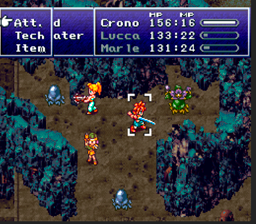

## _1.- Differences in turn-based games:_
  There are two differentiated classes:
  
  Simultaneous.
  
  Sequential.

  - Simultaneous games are those in which players make decisions without knowing what other players have decided to do.
  - Sequential games, also called IGOUGO, can be subdivided into three sections, ranked, round-robin start, and random.

  - The **_ranked games_** are those in which the first player is the one who always starts first.
  - The **_round-robins_** are decided by elimination.
  - The **_random_** ones in which the first player is decided randomly.

## _2.- Different kinds of turn-based combat systems:_

### _2.1. Classic Turn-Based Game_
   Players playing can spend all the time they want thinking about how to execute their next action, nothing in the game will move until
   they decide what to do.
 [Lnk](https://gfycat.com/cheerfulpopularamoeba-he-made-the-mistake-of-using-leer-or-something)
### _2.2. Active Time Battle_
   First introduced by Hiroyuki Ito in Final Fantasy IV, also in Chrono Trigger, he turns of the people playing are determined by
   a counter that is restarted each time an action is performed.
   
 [Lnk](https://forums.rpgmakerweb.com/index.php?threads/chrono-trigger-battle-system-to-rgss1.85887/)

### _2.3. Timed Turns_
   This methodology exists to solve a question, how long a player's turn can last? Basically, each player has a limited time to perform
   an action.

### _2.4. Phase-Based Turns_
   Also called We-Go, in this class of combat there are two distinct phases: decision phase and execution phase. In the    decision phase each
   player decides that they will do their units, in the execution phase the units perform the previously chosen actions simultaneously.
   
### _2.5. Clock-Based Turns_
All the actions of all the players are directly linked to the game clock.

### _2.6. Unit initiative_
   In this case the sequence of attacks depends on the initiative, which is an attribute of each unit, this attribute, in some cases, isn't always
   the same and can be modified during the battle.

### _2.7. Actions outside a turn_
   In some games like the saga X-How the players are allowed to act outside their turn, to be able to do it each unit must have, a minimum
   amount of points to be able to interrupt the other player and the actions that can carry out are limited by the number of points of the
   unit.

### _2.8. Special phases or actions_
   In some turns players are required to follow certain rules set by the game, such as not attacking or moving all units.

### _2.9. Real-Time Based Games_
   In another sphere, real-time based games are those in which the player timer matches with the game timer, that means that the action in the game is
   always continued.

### _2.10. Extra Point_
   It must be said that many games have a combination of real-time and turn-based combat. Such as Total War and Jagged Alliance 2.

## _3.- Pros & Cons_

### _3.1. Pros_
- The fact that there is no time limit for performing an action makes people who don’t like frantic games where you have to think and act fast
  able to enjoy this kind of games. This does not mean that the games are easy because in this class of games the AI must decide a smaller number
  of actions in comparison, for example, to the - AI of FPS games, and this means that you can code the AI to increase the difficulty in hardermodes
  of the game.
- In turn-based combat games the difficulty curve is suitable for each player as they can practice as many times as they want.

### _3.2. Cons_
- It could be argued that they are unrealistic games because in a battle, for example, you do not have a certain amount of time to act.
- It can be debated whether turn-based combat games are more or less immersive than real-time combat games.
- Real-time combat games are more multiplayer-friendly than turn-based games.

## _4.- History_

If we have to talk about the history of turn-based combat in RPGs we have to start talking about Final Fantasy (1986), which included the formula on
which many games would be based. In a part of the screen are the enemies and in the other the members of your team, each with special abilities.
The most popular games that followed this formula are:

-	Dragon Quest (or Warrior 1986).

 [Link](https://en.wikipedia.org/wiki/Dragon_Quest_(video_game)#/media/File:Dragon_quest_battle_2.png)

-	Pokémon (1996).

 [Link](https://en.wikipedia.org/wiki/Pok%C3%A9mon_Red_and_Blue#/media/File:Bulbasaur_pokemon_red.png)

It was in Final Fantasy IV, 1991, where we could see for the first time the Active Time Battle, designed by Hiroyuki Ito. Which was a more action-based
approach to the previous design of combat.

 [Link](https://en.wikipedia.org/wiki/Final_Fantasy_IV#/media/File:Ff4wiki.PNG)

Another game we should talk about is Super Mario RPG which incorporated new mechanic into the turn-based RPG scene. Timed hits in order to do more damage
to your opponents. This addition made the fights more entertaining as it incorporated a "mini-game" within each fight. Another game that also used this
system is Suikoden II.

 [Link](https://en.wikipedia.org/wiki/Super_Mario_RPG#/media/File:Super_Mario_RPG_battle.png)

Other games that should be mentioned in this era are:

-	Tactics Ogre: Let us Cling Together (1995).

 [Link](https://en.wikipedia.org/wiki/Tactics_Ogre:_Let_Us_Cling_Together#/media/File:Tactics_orge_ps1.png)

-	Final Fantasy Tactics (1998).

 [Link](https://en.wikipedia.org/wiki/Final_Fantasy_Tactics#/media/File:BattleGrid.jpg)

It was from the 2000s when action RPGs began to dominate the market with games like Kingdom Hearts and Souls. Some of the changes that made RPG games
in that time where focusing the combat in a more action-based style.
Final Fantasy tried to avoid this change with the release of Final Fantasy X but this was the last title that of the popular franchise that was 100%
turn-based.

 [Link](https://www.gamespot.com/reviews/final-fantasy-x-x-2-hd-remaster-review/1900-6415711/)

## _5.- Game combat analysis:_

In this space we will analize the combat system of some important games in the RPG genre.

### _5.1 Pokémon_

Pokémon combat falls into the classic genre, this means that it first attacks the fastest pokémon and then the opposite. In this saga we find that there
is a system of "types" that defines the characteristics of each pokemon.

Depending on the type of pokemon, it will have certain advantages and disadvantages over other types.

This conditions the combat since if they face two pokemon, for example fire type against water type, the one that has the advantage of the type will have a clear
advantage with respect to its opponent.

On the other hand there is the pokemon skills factor. There are two kinds of movements:

- Those that directly harm the enemy.
- Those that modify the characteristics of both the pokémon itself and that of the opponent.

It should be mentioned that in the middle of the fight the trainers can decide to change the pokémon that is fighting or cure the one that is in the battlefield.

With these three factors, a combat system is built that is easy to understand but difficult to master, as all the previously mentioned conditions must be taken into
account.

 [Link](https://as.com/meristation/2018/09/29/analisis/1538244073_579544.html)

### _5.2 Chrono Trigger_
Chrono Trigger was first published in 1995 and is considered one of the most important games in the RPG family.

The game was published by Square Enix and designed by what was known as the dream team:

- Hironobu Sakaguchi, creator of Final Fantasy.

- Yuji Horii, creator of Dragon Quest.

- Akira Toriyama, creator of Dragon Ball.

The combat in this game revolves around the Active Time Battle (ATB) system, in which you have to wait for the action bar of the different characters to be full in order to carry out an attack.

In the battles of Chrono Trigger more than one ally and an enemy participate in the battlefield. This implies a layer of strategy since if you wait until all the action bars are full you will be able to realize three, or more, movements in a row, however, also implies that the enemies will have more time to attack you.

The special attacks of the game usually have small areas so if you are lucky enough to have many enemies together you will inflict more damage, which adds another layer of strategy.

 [Link](https://extralifereviews.files.wordpress.com/2015/06/chrono-trigger-and-final-fantasy-vi-battle-comparison.png)

### _5.3 Epic Seven_
Epic Seven was released in 2018 for both IOS and Android, was created by Super Creative and published by Smilegate Megport.

The combat system is based in the active time battle system, but in this case the ammount of time each character has to wait between attacks is descripted by their velocity stats.

In this game we have six different types of what are called heroes.

- Warrior: straightforward melee combat, caracterised by it's high damage.
- Knight: tank and support, are the ones incharged of keeping alive all the other units.
- Thief: high attack and high speed, usually deal criticall damage.
- Mage: damage dealers, support, it all deppends on the character and their kit.
- Ranger: more foccused to deal damaged through debuffs and dual attacks.
- Soul Weaver: heal the other characters, but can also be used as a tank.

The combat system in Epic Seven is based in the traditional game Rock-Paper-Scissors. It is applied to five different elements:
- Earth.
- Fire.
- Ice.
- Light.
- Dark.

But in addition to that there's another layer of complexity, it's releated to the hitting system and this is how they are releated:

- Normal Hits: are based on the Attach stat of the character.
- Crushing Hits: apply 30% more of damage than a Normal Hit.
- Miss Hit: have it's damage reduced in a 25%.
- Critical Hits: are based on the Critical Hit Damage stat of the character.

Every character can be equiped with armor and weapons which have their own quality ranking.

All this things putted together end up being a complex combat system with lots of things to know and take into account in order to defeat all the enemies and players.

 [Link](https://mmos.com/review/epic-seven)

## _6.- Bibliography_
- [Chrono Trigger’s Excellent Battle System Returns](https://kotaku.com/chrono-trigger-s-excellent-battle-system-returns-1764916527).
- [Turn based Combat System](https://evennia.readthedocs.io/en/latest/Turn-based-Combat-System.html).
- [Turn-based strategy](https://en.wikipedia.org/wiki/Turn-based_strategy).
- [Juego por turnos](https://es.wikipedia.org/wiki/Juego_por_turnos).
- [Videojuego de estrategia por turnos](https://es.wikipedia.org/wiki/Videojuego_de_estrategia_por_turnos).
- [12 ways to improve turn-based RPG combat systems](https://www.gamasutra.com/blogs/CraigStern/20130411/190332/12_ways_to_improve_turnbased_RPG_combat_systems.php).
- [Turns, rounds and time-keeping systems in games](https://en.wikipedia.org/wiki/Turns,_rounds_and_time-keeping_systems_in_games#Turn-based).
- [Turn-Based](https://www.giantbomb.com/turn-based/3015-192/).
- [What Happened to Turn-Based Games?](https://web.archive.org/web/20130421013333/http:/www.firingsquad.com/games/tbgameseditorial/).
- [Analysis: Turn-Based Versus Real-Time](https://www.gamasutra.com/php-bin/news_index.php?story=25920).
- [Gameplay Design for Role-Playing Battle Systems](https://publications.lib.chalmers.se/records/fulltext/165277.pdf).
- [How to revamp the turn-based RPG combat system](https://gyglounge.com/revamping-turn-based-rpg-combat-final-fantasy-jrpg/).
- [Point - CounterPoint: Turn Based vs. Real Time Strategy](https://web.archive.org/web/20070226185919/http:/www.strategyplanet.com/features/articles/pcp-turnvsreal/).
